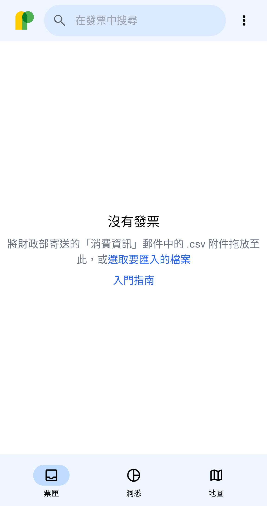
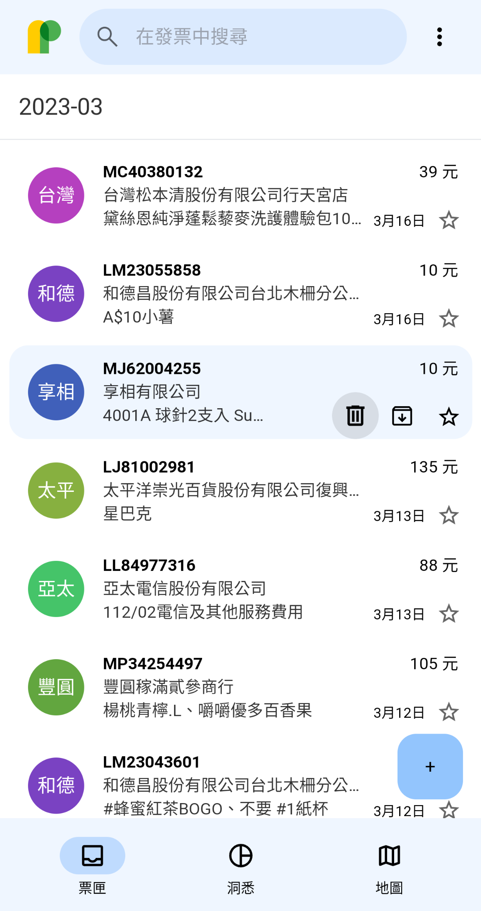
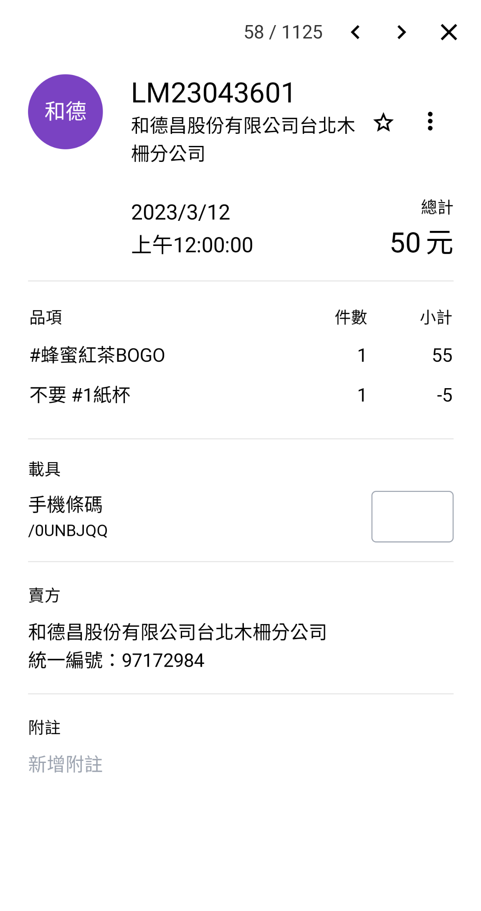
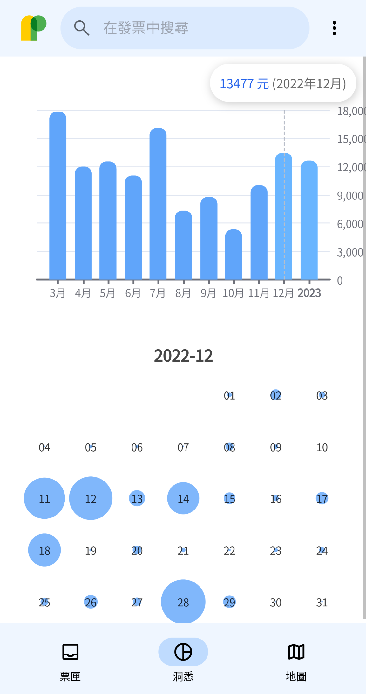
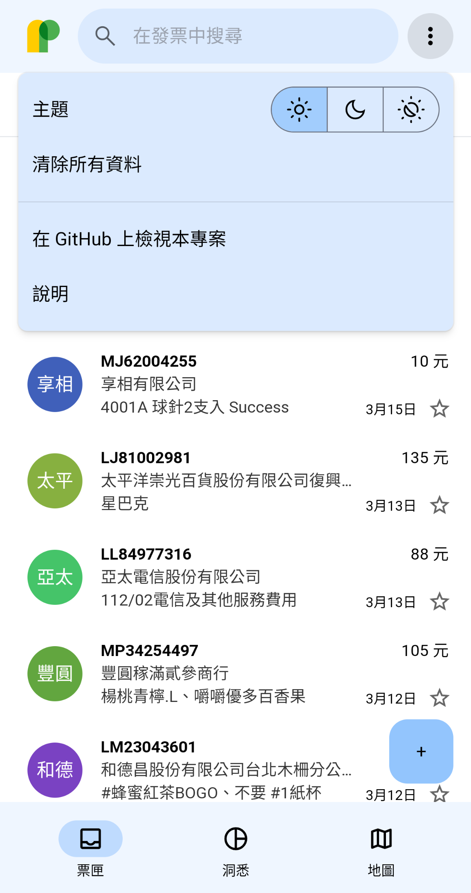
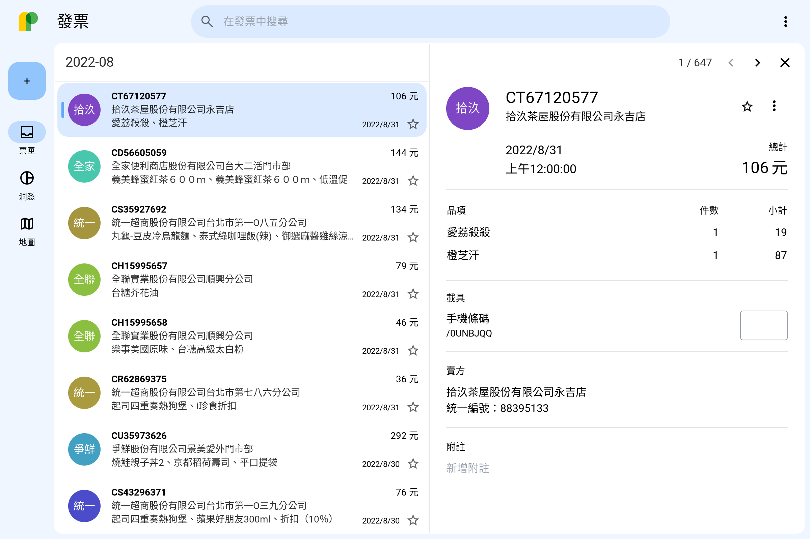
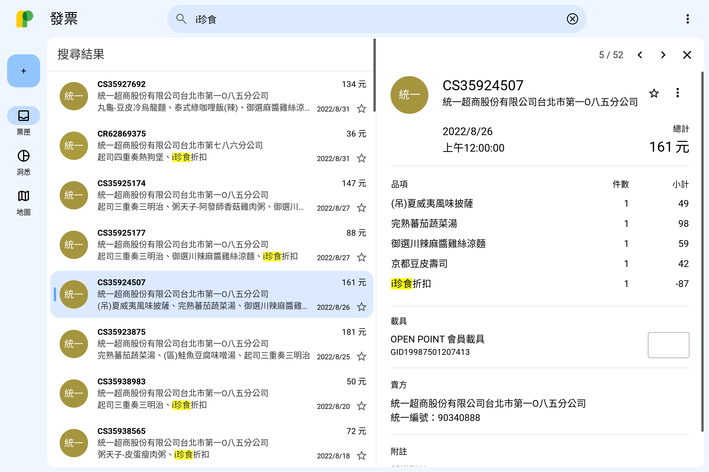

# Paperrolls

<a href="https://paperrolls.vercel.app/inbox" title="Paperrolls" target="_blank" rel="noreferrer"></a>

讓你以使用收件匣般的方式管理你的統一發票！

## 功能

<p>
  
  
  
  
  
  
  <br>
  
  
</p>

- 📩 匯入「消費發票彙整」CSV 檔
- 🔍 搜尋發票
- 🌪 篩選發票
- 📝 為發票留下附註
- ⭐ 為重要發票加上星號
- 🫥 封存~~不可見人~~的發票
- ✅ 批次操作
- 🚮 刪除發票
- 📈 統計圖表
- 🎑 深、淺色主題

## 特色

### 優雅的使用者介面

得益於 [Material Design 3][md3]，本應用程式以賞心悅目的畫面，佐化繁為簡的哲學，為你帶來最親和的使用體驗。

### 支援多種使用環境

Paperrolls 是一款網路應用程式，這意味著只要有網頁瀏覽器，便隨開即用！Paperrolls 也針對不同的使用場景最佳化：無論是桌上型電腦或手機，皆可輕鬆操作。本應用程式亦初步支援[漸進式網路應用程式（PWA）][pwa]，你可以將其安裝到程式集，以便隨時啟動。

> **Note**
>
> 已知本應用程式無法在部分瀏覽器的「私密瀏覽」模式下正確執行。

### 你的資料就是你的資料

目前，所有你在 Paperrolls 產生的資料皆儲存於你的裝置上（具體而言是瀏覽器的「[IndexedDB][idb]」），無法經由外部存取，因此無須擔心你的資料會被他人利用。然而，你仍應避免在本應用程式中儲存敏感資訊，因為這些資料並未加密，任何有機會使用你的裝置的人士皆能輕易查看。

> **Warning**
>
> - 在「無痕模式」中執行本應用程式，隨後關閉視窗，你的資料將會遺失。
> - 若於「清除瀏覽資料」時勾選了「網站資料」，你的資料將會遺失。
> - 目前尚無法從本應用程式匯出你的資料。

## <a id="faq">常見問題</a>

### 問：我如何新增我的發票？

現階段 Paperrolls 僅支援一種新增發票的方式——從中華民國財政部寄發的雲端發票「消費發票彙整」CSV 檔案匯入。要取得該檔案，請參考以下步驟：

1. [申請一個共通性載具][sign-up-einvoice]（手機條碼）
2. 接著前往「[手機條碼專區 > 通知設定][opt-in-csv]」，選擇「每月寄送」並按下「設定寄送通知信」按鈕

至此，你已完成設定。當平日消費時，請使用你的手機條碼索取發票。待到每月初，財政部會寄送主旨為〈財政部電子發票整合服​務平台-消費發票彙整通知，手機條碼:/��\*\*���(每月)〉的郵件至你的收件匣，請下載其中的附件（以下簡稱該附件為**彙整檔**）。

現在你可以前往 Paperrolls 匯入你的發票了。（詳見下一小節）

### 問：我已經有「彙整檔」了，該怎麼匯入？

要將彙整檔匯入 Paperrolls ，有多種方式：

- 將下載至本機的彙整檔拖放至 Paperrolls 中即可匯入
- 按一下「+」（加號）按鈕（桌面版位於左上角，行動版位於右下角），從檔案選擇器中選取欲匯入的彙整檔以匯入
- 當尚未有任何發票時，按一下畫面中央的「從財政部匯入」亦可開啟檔案選擇器以匯入

> **Note**
>
> 你可以同時選取多個彙整檔。

### 問：為什麼每張發票的時間都是當日子夜？

由於彙整檔僅提供發票的**消費日期**，並未有確切時間，因此本應用程式暫且將每張發票的消費時間記為 `00:00:00`。

### 問：可以像其他發票 APP 一樣登入手機條碼然後自動獲取發票嗎？

尚無此功能。

## 開發

### 仰賴
[![React][badge-react]][react] [![TypeScript][badge-typescript]][typescript] [![Dexie][badge-dexie]][dexie] [![Tailwind CSS][badge-tailwindcss]][tailwindcss] [![Vite][badge-vite]][vite] ……等工具。

### 建構

若要自行建構，請參考以下步驟：

1. 將本專案儲存庫下載至本機
   ```sh
   git clone https://github.com/Lzmxya/paperrolls.git
   ```
2. 安裝相依套件
   ```sh
   npm install
   ```
3. 建構
   ```sh
   npm run build
   ```
4. 如要啟動即時預覽伺服器
   ```sh
   npm run dev
   ```

## 藍圖

參見 [Projects][roadmap] 頁面。

[md3]: https://m3.material.io
[pwa]: https://w.wiki/vwU
[idb]: https://developer.mozilla.org/en-US/docs/Web/API/IndexedDB_API
[sign-up-einvoice]: https://www.einvoice.nat.gov.tw/APCONSUMER/BTC501W
[opt-in-csv]: https://www.einvoice.nat.gov.tw/APCONSUMER/BTC513W
[roadmap]: https://github.com/Lzmxya/paperrolls/projects

[//]: # (badges)
[badge-react]: https://img.shields.io/static/v1?message=React&color=222222&logo=React&logoColor=61DAFB&label=
[badge-typescript]: https://img.shields.io/static/v1?message=TypeScript&color=3178C6&logo=TypeScript&logoColor=FFFFFF&label=
[badge-dexie]: https://img.shields.io/static/v1?message=Dexie&color=266FC1&logo=Adminer&logoColor=FFFFFF&label=
[badge-tailwindcss]: https://img.shields.io/static/v1?message=Tailwind+CSS&color=38BDF8&logo=Tailwind+CSS&logoColor=FFFFFF&label=
[badge-vite]: https://img.shields.io/static/v1?message=Vite&color=646CFF&logo=Vite&logoColor=FFDD35&label=

[//]: # (badge-links)
[react]: https://react.dev
[typescript]: https://www.typescriptlang.org
[dexie]: https://dexie.org
[tailwindcss]: https://tailwindcss.com
[vite]: https://vitejs.dev
